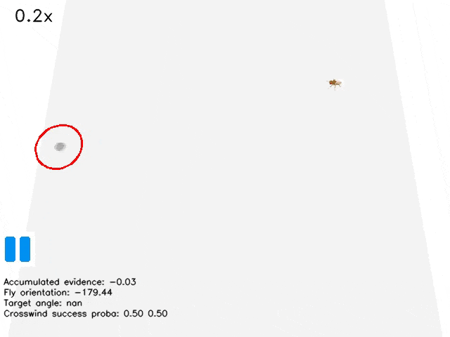

#  Embodied Drosophila Simulation

This is a simple project where I followed the [Flygym](https://github.com/NeuroMechFly/Flygym) tutorial to run a basic simulation of a Drosophila (fruit fly) walking and tracking an odor plume. It uses the Flygym framework, which is built on MuJoCo. My goal here was to get a feel for embodied agent modeling and see how these simulations work under the hood.

---

##  Demo

Here’s a quick look at the fly in action:  

---

## Project Overview

- **What this is:** A beginner project based on the Flygym tutorial.  
- **What I did:** Ran the simulation, explored the code, and started understanding how physics engines like MuJoCo are used in these models.  
- **Why I did it:** To build a foundation for future work in embodied neural simulations and explore its' feasibility for simulating realistic behavior driven by complex neural inputs.

---

## How to Run It Yourself

1. **Clone the repo:**

git clone https://github.com/bkim346/Flygym.git

cd Flygym

2. **Install the requirements:**

pip install -r requirements.txt

3. **Generate odor plume:**

python src/Simulate_odorplume.py

The plume file I generated is too large to upload it to github. But the seed I used was 777.

4. **Run the simulation:**

python src/plume_tracking.py

---

## What I Learned

- How to run Flygym simulations and use their API.
- Basics of MuJoCo and how it handles physics in biomechanical models.
- How embodied simulations are structured and how neural controllers can be connected.

---

## What’s Next?

For now, this is a basic walkthrough of the tutorial. Moving forward, I’m planning to:

- Modify the neural controllers to experiment with different behaviors.
- Explore more complex environments and tasks for the fly to perform.

---

## Project Structure

├── outputs/
│   └── plume_tracking
│       └── plume_dataset  
│           └── plume.hdf5               # Simulated plume         
│           └── plume_tracking_fly.mp4   # Plume tracking video 
│           └── plume_tracking_fly.gif   # Plume tracking gif
├── src/                         # Code file
│   └── simulation_script.py
├── requirements.txt
└── README.md

Acknowledgments
Big thanks to the Flygym and NeuroMechFly teams for their awesome tools and documentation.
